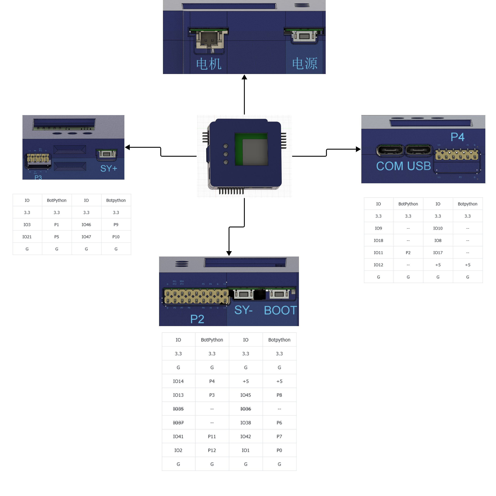

# BotPython ESP32-S3 板卡与接线

板载LCD为240×240，显示示例使用黑底白字和固定行更新。P编号与GPIO编号不同。

## 先认方向，再找小字

第一次上课只连接电脑和开发板，先运行 T01 板载屏幕示例；不用接任何外部传感器。

下图来自用户提供的[智能花盆开发板使用手册](https://my.feishu.cn/docx/C8obdg9TCoZf4txzudLcaJUqnbd)，是接口布局示意图，不是实物接线照片。点击图片可放大查看。



| 对照原图找位置 | 这一侧有什么 | 初学者怎么用 |
|---|---|---|
| 上方：电机、电源 | 电机接口和电源开关 | 第一课不用电机接口 |
| 右侧：COM、USB | 两个USB接口、P4排针连接器 | 用数据线连接电脑；在软件选择检测到的对应端口 |
| 下方：SY−、BOOT | P2排针连接器 | 常用土壤P0、光照P11/P12、CO₂ P7位于这一组，逐针查表 |
| 左侧：SY+ | P3排针连接器 | 温湿度P5等引脚位于这一组，逐针查表 |

**不要把整组连接器的“大字 P2/P3/P4”当作程序要填的引脚。** 例如，下方连接器虽然标为 P2，其中仍包含 P0、P7、P11、P12 等不同信号。程序选择的是原图表格中“BotPython”列的编号；“IO”列是芯片编号。

## 接线四步

1. **断电**：拔下USB线，并断开其他电源。不要带电拔插传感器。
2. **找位置**：按上图的 COM/USB、SY−/BOOT、SY+ 文字认方向，再对照表找到目标信号针。翻转板子后左右会改变，不凭记忆插线。
3. **核对每根线**：G/GND表示地；SDA/SCL分别是光照模块的数据/时钟线；TX表示模块发送端。供电线必须按该模块标注核对，不能因为看到“+5”就把信号线接过去。
4. **上电运行**：确认没有错位、短接后连接电脑，打开对应课程。读数前应出现传感器名称，连续观察至少三轮；缺失提示时先停止、断电，再检查接线。

原图没有给出所有传感器模块的插头朝向和供电规格，因此不能用本图推断模块插头的线序。尚未确认的电源电压或插头方向，请先向器材提供方核对。

## 常用信号速查

| 功能 | BotPython接口 | 芯片引脚 |
|---|---|---|
| HS-S33A土壤1/2/3 | P0/P1/P2 | GPIO1/3/11 |
| BH1750 SDA/SCL | P11/P12 | GPIO41/2 |
| DHT11数据 | P5 | GPIO21 |
| JW01 CO₂接收 | P7 | GPIO42，固件UART1 |
| 水泵控制 | P10 | GPIO47，必须核对驱动有效电平 |
| WS2812B-B | 板载RGB | GPIO48 |
| 按键A/B | SY-/SY+ | GPIO39/40，按下为低电平 |
| 外接串口回显课程 | P4发送/P3接收 | GPIO14/13，UART2 |
| 原生USB | USB D-/D+ | GPIO19/20 |

LCD使用GPIO8/9/10/12/17/18，麦克风使用GPIO4/5/6；GPIO35～37为内部PSRAM保留，不能当普通LED引脚。CP2102连接ESP32 UART0用于REPL；不要用外设例覆盖该通信口。

### 原始资料中的差异

飞书文档另有“智能花盆”框架图，标注水泵P2、土壤2/3为P3/P4，与本工程此前确认的水泵P10、土壤2/3为P1/P2不一致。该差异尚待确认；本手册不将这张框架图作为接线步骤，也不据此修改程序。第一课无需连接水泵或第二、第三路土壤传感器。

## 板载RGB正确控制

```python
from mpython import rgb
rgb.fill((0, 40, 0))  # 设置整组颜色
rgb.write()           # 提交到IO48上的WS2812
```

逐灯点亮使用从0开始的索引：

```python
rgb.fill((0, 0, 0))
rgb[0] = (0, 40, 0)
rgb.write()
```

固件BotPython板型配置3个灯珠，默认亮度0.3；`len(rgb)`表示固件配置数量，不证明实物焊接数量。流水灯遍历`0..len(rgb)-1`；若板上实际只装1灯，只能观察第0步，其余步为暗。`fill`与`write`的亮度处理由固件实现，建议先使用低亮度值观察，不更改底层驱动。单色GPIO高低电平或PWM不能替代WS2812时序。

新版T11～T21使用以上映射。旧保存的XML不会自动变更，请从新版“示例项目”重新加载或打开随教程的新XML。RGB积木里的清空颜色是熄灭LED，不是清空LCD；无需删除。

接线前断电。未接模拟土壤引脚可能产生浮空数值，不能据此判断已连接。DHT11、BH1750等缺失状态由课程显示，仍可继续循环。水泵需要独立驱动，禁止直接用GPIO供电。
