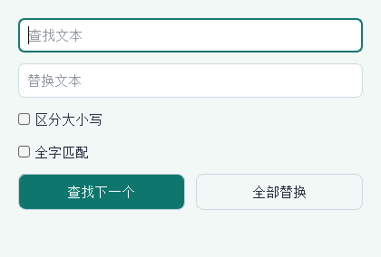

# BotPython 用户手册

适用：BotPython Windows 11 发布包、BotPython ESP32-S3 板卡（文档更新于 2026-09-26）。本文按已实现功能编写，不把设计中的多文档、Notebook、云端账户或深色主题当作现有功能。首次使用可先看[五步开始向导](开始向导.md)，版本和测试范围见[测试与版本记录](教程测试记录.md)。

## 1. 第一次使用：连接、打开、运行、停止

按F1或“帮助 → 用户手册”打开开始向导。“打开示例项目”进入课程列表；“阅读图文用户手册”在软件内阅读本文，无需安装Markdown编辑器。

1. 保留发布包的完整目录，双击 `BotPython.exe`；不要只复制一个 EXE，也不要使用过期的旧构建目录。
2. 用可传输数据的 USB 线连接板子。顶部端口下拉框自动更新；有勾号的端口是当前连接，颜色和文字共同表示连接状态。
3. 点击未连接端口进行连接；点击已勾选端口断开。手动断开后需要时再手动连接。菜单“设备 → 扫描设备”或 F5 可主动扫描。
4. 在“设备”菜单选择“ESP32 设备”。当前默认是实物，传感器/LCD示例不能在本地模拟器运行。
5. 选择“文件 → 示例项目”（Ctrl+E），搜索“板载 IMU”，选中后阅读说明，点击“加载示例”。已有修改先保存。
6. 点击“运行”（F9）。板载240×240 LCD显示黑底白字；第1行采样次数增加，第2～7行是IMU数据。
7. 观察至少3轮，再点击“停止”（Shift+F9）。再次运行另一例，确认没有重复创建事件循环错误。
8. 保存练习时选择“文件 → 同时导出积木与 Python”，得到同名 `.xml` 和 `.py`；后续积木编辑打开XML，阅读/修改Python打开PY。

学习顺序建议：T01板载屏幕 → T03土壤 → T04多传感器容错 → 接齐外设后T05/T06/T07 → 其他课程。全部课程及可直接打开的文件见[逐例教程](示例教程.md)。

## 2. 认识主界面

截图来自当前源码实际Qt窗口，端口为未连接状态。没有把测试占用时的连接状态伪装成已连接。

| 区域 | 用途 |
|---|---|
| 文件菜单 | 新建、打开、保存、导出Python、同时导出XML/PY、示例、最近项目、退出 |
| 编辑菜单 | 撤销/重做、清空、积木缩放、设置、查找替换 |
| 设备菜单 | 运行目标、扫描/连接/断开、下载代码、板子文件系统、固件管理 |
| 视图菜单 | 教学模式、代码预览、绘图、串口监视器、模拟器区域 |
| 顶部端口 | 选择和切换串口；不要仅依据COM号或CP210x名称判断板卡型号 |
| 运行/下载/停止 | 分别是内存运行、写main.py、停止当前可取消任务 |
| 积木编程 | 从分类拖入积木，拼接语句和输入参数，右键操作；使用编辑菜单撤销 |
| Python代码 | 独立手写草稿，首次进入可复制生成代码；不是任意Python反向转积木 |
| 代码预览 | 只读的积木生成代码；教学模式可并排查看 |
| 右侧工具及输出 | 板卡/模拟器/绘图和控制台；观察错误和运行信息 |
| 分隔条 | 左右拖动调整积木/工具区域；教学模式下可调整源码预览宽度 |

项目名显示在标题栏，修改标志表示尚有编辑内容。当前只打开一个项目；“积木/Python”是两种编辑模式，不是两个项目标签。

## 3. 板卡和接线

没有电路经验时，先阅读[接口方向图与接线四步](板卡与接线.md)。整组连接器标号与程序中的信号引脚编号并不相同，接线时必须逐针核对。

BotPython 使用ESP32-S3、240×240 ST7789 LCD。板子有原生USB和CP2102串口桥两条连接路径。串口编号随电脑和USB口不同而变化，请以软件顶部端口下拉框实际显示为准。

| 外设 | BotPython端口 | ESP32-S3引脚/含义 |
|---|---|---|
| HS-S33A土壤1 | P0 | GPIO1，模拟电压输入 |
| 土壤2/3 | P1/P2 | GPIO3/GPIO11；未接时不要把浮空ADC当湿度 |
| BH1750 SDA/SCL | P11/P12 | GPIO41/GPIO2，I²C；不是模拟光照输入 |
| DHT11 | P5 | GPIO21，数字温湿度 |
| 水泵控制 | P10 | GPIO47；有效电平和驱动电路需核对 |
| JW01 CO₂ | P7 | GPIO42接板端UART RX；本次驱动默认UART1、RX42、TX38、9600，TX线是否使用需核对模块 |
| 板载RGB | 板载 | GPIO48，WS2812；不是GPIO2普通LED |
| 板载按键 | SY-/SY+ | GPIO39/GPIO40 |
| 原生USB | USB D-/D+ | GPIO19/GPIO20 |

**P编号不等于GPIO编号**：`MPythonPin(0, ...)` 是P0，而 `machine.Pin(2)` 是GPIO2（P12）。GPIO8/9/10/12/17/18与LCD相关；GPIO4/5/6与麦克风相关，GPIO35～37被内部PSRAM使用。当前教学例已改为固件mpython.rgb（IO48），不再将GPIO2当作板载LED。完整板表见[硬件与接线基线](板卡与接线.md)。

接传感器时先断电，核对电源、地和信号；GPIO不能直接给水泵供电。板载 IMU/LCD、P0 土壤、P7 CO₂、P11/P12 BH1750 为常规板载或外接外设；DHT11 等需按接线基线接入后才有读数。其他外接模块的存在不由示例名称保证。

## 4. 积木与Python操作

1. 在分类中选择积木拖到工作区，将上下凸凹口连接；圆形/六边形输入插入数值、文本或条件块。
2. 初始化块放在循环前；传感器采样和数据显示放循环内。
3. 屏幕分9行，行号1～9。每轮所有行的数据写完后，只放一次“刷新屏幕”；不要每轮清屏再逐行刷新。
   示例数值统一带名称：`Soil P0: 3347`、`Light lux: 27.5`、`Temp C: 25`、`Hum %: 40`、`CO2 ppm: 420`、`Acc X: ...`、`Gyro X: ...`。当前固件字库使用英文短标签；分别对应土壤、光照、温度、湿度、二氧化碳、加速度和角速度。缺失时如 `Temp C: NOT CONNECTED`，保留名称。
4. 使用“视图 → 教学模式/代码预览”检查生成结果。示例PY前面的Screen240和传感器适配类是显示/容错支持代码，不要只复制末尾循环而漏掉它们。
5. Python模式可编辑代码；手写草稿与积木生成代码不同，切回积木不会把任意Python自动还原成积木。
6. Ctrl+Z/Y撤销/重做按当前模式处理；Ctrl+H查找和替换。当前不要依赖尚未实现的固件API自动补全或多文档恢复。

## 5. 打开、保存与防丢失

| 动作 | 文件/结果 |
|---|---|
| 打开项目 Ctrl+O | 选择 `.xml` 或 `.py`；XML恢复可拖拽积木，PY恢复文本 |
| 保存 Ctrl+S | 积木模式保存XML；Python模式保存PY |
| 导出Python Ctrl+Shift+E | 导出代码，不能恢复完整积木布局 |
| 同时导出积木与Python | 生成同名XML/PY，便于提交作业和代码阅读 |
| 最近项目 | 快速重新打开；切换前先保存当前内容 |

注意：普通保存只使用一个修改标志：保存XML后，另一份手写Python草稿可能没有单独保存。**有手写草稿时，先在Python模式保存到独立 `.py`，再保存XML；关闭前分别重新打开核对。** 不把“标题没有修改标志”当两份草稿都已落盘。成对导出是方便交付入口，不代替独立手写草稿的保存检查。

教程目录的PY/XML是完整文件，`examples/manifest.json`记录生成内容SHA256；不建议以截图或说明中的小片段代替完整源文件。

## 6. 运行、下载与固件：三件不同的事

| 操作 | 保存位置 | 重启后 |
|---|---|---|
| 运行 F9 | 当前代码在板子内存执行 | 不保证保留 |
| 下载代码 Ctrl+U | 替换板子 `main.py`，写入后软复位 | 启动时执行main.py |
| 烧录固件 | 写入MicroPython/BotPython固件镜像 | 更换板子运行环境，不能等同下载学生代码 |

先运行验证，再考虑下载。下载前通过“板子文件系统”导出原 `main.py` 留存；确认覆盖后等待传输、校验和复位完成。进度传输到100%不代表全部阶段已结束。已有备份文件不能代替你保存在电脑上的原文件。

点击停止后观察状态与输出；若长时间无响应，停止继续发送命令，断开后核对端口，必要时手动复位。当前停止提示符识别仍有已知问题，尤其不要凭一条“停止成功”就认定故障恢复完整。

## 7. 文件管理与批量传输

图为未连接设备时的空列表，仅说明控件位置，不代表板上没有文件。

1. “设备 → 板子文件系统”打开板载目录；双击目录进入，上级按钮返回。
2. 选择文件预览；文本预览上限256KiB，不代表文件只能这么大。
3. 可新建目录、重命名、删除已选项；运行所选PY前先读清内容。
4. 上传文件/目录、下载所选文件时选择来源和目标，检查逐项结果。单文件传输上限16MiB，目录树有层数/条目限制，还受板上剩余空间约束。
5. 同名文件当前默认拒绝/跳过，不是自动替换；需要替换时先下载备份并明确处理旧文件。
6. 取消后检查结果；未完成临时文件不要当正式作业文件。当前没有设计要求的完整断电事务恢复向导。

## 8. 固件管理

1. 关闭其他占用串口的软件，记录板卡型号，备份板上用户文件。
2. “设备 → 固件管理器”，选择“使用 BotPython 默认固件”；需要其他镜像则“选择自定义固件…”。
3. 核对识别的芯片/镜像信息、端口和波特率。提供115200、230400、460800、921600；连接不稳可降低到115200。
4. 点击烧录，观察连接、写入、验证日志和进度；成功后按提示重新连接并核对固件身份。
5. “通用MicroPython在线下载”属于高级功能，不能保证包含LCD/IMU/BH1750等BotPython专用驱动。

当前烧录窗口操作中不能取消，最长等待超时。不要把关闭窗口作为正常取消方式。“擦除Flash”会删除固件和数据，不是解决所有连接故障的常规步骤。恢复镜像、刷写及断电启动没有包含在每个RAM教程的通过结论中。

## 9. 输出、绘图、语言和主题

串口监视器用于查看print和错误信息；学生程序调用UART1.write不一定出现在IDE的USB/REPL输出中。当前运行期间发送输入的能力有限，不能把UART物理接收测试当成IDE输入框回显。

“视图 → 绘图”接收专用行协议，例如 `@plot {"v":1,"series":"soil","value":42,"unit":"raw","t_ms":1000}`。最多8通道、每通道1000点；CSV导出的是当前缓存，不是全程记录；PNG是当前绘图截图。暂停时画面冻结，后台仍收集；恢复显示最新缓存。CSV导出采集数据，PNG导出当前画面。

“编辑 → 设置”调整语言、主题及编辑偏好。当前提供薄荷森林、晴空蓝、紫丁香三款浅色风格；不支持深色/跟随系统的完整功能。选择简体中文或English后应用，积木与界面切换；自写文字、变量、代码注释不自动翻译。底层错误可能仍保留原始语言。

## 10. 常见问题

| 现象 | 操作 |
|---|---|
| Python DLL或Qt插件加载失败 | 重新解压完整发布目录，保留 `_internal`；勿只移动EXE；核对是否用了旧build产物 |
| 没有端口 | 更换数据线/USB口，设备管理器检查USB串口驱动，F5扫描；设备号不固定 |
| 端口占用 | 关闭其他IDE/串口助手，勿同时连接同一路REPL |
| 提示选择实物运行 | 设备菜单选ESP32，选择端口连接后再运行 |
| NOT CONNECTED / ERROR | 核对模块型号、电源/地、P与GPIO映射、驱动及采样间隔；没有外设时这是状态提示，不是假数据 |
| 土壤值一直相近 | 稳定环境可能正常；查看Sample计数，改变探头环境再比较；原始ADC不是湿度百分比 |
| 屏幕只显示一帧 | 查循环内是否重新读取、写入并刷新；等待真实周期；停止后重新加载最新XML |
| 屏幕闪烁 | 不要循环清屏；一轮集中更新；旧保存XML不会自动升级 |
| Event loop already running | 使用随教程的完整Screen240包装；停止后再运行；旧固件/旧片段不要反复创建GUI |
| GPIO34/LED不工作 | 从示例项目重新加载新版XML；板载灯使用mpython.rgb和write()，不用GPIO2/PWM |
| 英文未全切换 | 重开相应窗口并记录未翻译文字；自写文本本就不翻译 |

反馈问题请提供：软件来源/版本、教程编号、PY/XML文件（先去掉密码）、端口和固件身份、接线、完整错误及复现步骤。不要仅截取最后一行错误。

## 11. 教师验收

每课依次检查：打开XML能继续拖拽 → 生成完整PY → 保存后重新打开一致 → 指定输入得到预期输出 → 连续采样至少3轮 → 断开/缺失外设行为明确 → 停止后可运行下一例。需要独立上电的作业，额外完成原文件备份、main.py下载复位、断电重启和原程序恢复。

当前测试分为自动化模拟验证和实板RAM验证。模拟能验证循环、分支、显示及容错逻辑，但不能证明电气接线、真实测量精度、灯光和水泵动作。每课实际状态以[测试记录](教程测试记录.md)为准。
