# 21个示例的使用教程

布局修正：T19、T20的主程序和函数定义已在内置XML中分开摆放，正常打开不再重叠。截图测试只缩放，不再自动排列。旧保存文件保留原位置；如仍重叠，请重新加载新版示例，或手动拖开函数定义后保存。

备课先选[适合年级的路线](教师教学指南.md)，操作时对照[课堂图卡](课堂操作图卡.md)。每课依次读“问题 → 四步图 → 学生动手 → 达标要求”，再按需查阅后面的技术说明。流程图用于解释程序，不是实物屏幕照片。

版本：2026-09-26。每课的XML/PY来自当前软件真实Blockly加载与生成，包含完整支持代码。不要用旧示例说明中的短片段代替这些文件。编号、菜单名称和文件SHA256见[清单](examples/manifest.json)，版本与测试范围见[测试记录](教程测试记录.md)。

## 课程公共操作与验收

每课按以下流程完成，再做该课专属练习：

1. 阅读“接线与适用范围”，只使用匹配的板卡与外设。P0/P5是BotPython端口，GPIO2/GPIO34是芯片编号，不能混淆。
2. 保存当前两个模式的草稿。“文件 → 打开项目”打开该课XML；或“文件 → 示例项目”选择同名例子。
3. 检查积木连接和参数；“视图 → 教学模式”对照生成Python。PY文件前部的Screen240/传感器适配器同样属于程序。
4. “设备 → ESP32设备”，选端口连接。点击“运行”进行RAM测试；需要主板LCD的课程不使用本地模拟器。
5. 观察至少3轮，以计数/新数据确认重新采样。LCD固定9行，传感器课第1行通常是Sample；同样数值不一定代表卡死。
   所有数字读数前都有名称：Soil P0（土壤）、Light lux（光照）、Temp C（温度）、Hum %（湿度）、CO2 ppm（二氧化碳）、Acc/Gyro XYZ（IMU）。这是板载字库可显示的短标签，未连接时名称后为NOT CONNECTED。
6. 点击停止，然后重新运行同课或下一课。保存XML与PY到新位置，重新打开检查。独立手写PY必须另外保存。
7. 记录板子、固件、接线、输入、预期/实际和异常。下载main.py及断电启动是额外测试，先备份，结束后恢复原程序。

**状态说明**：T11～T21已按BotPython重新适配：WS2812使用IO48的mpython.rgb，按键A为GPIO39，DHT11为P5，夜灯使用BH1750，串口回显单独使用UART2/P3/P4。所有课程循环读取并显示P0；模拟、实板RAM和人工物理验收分开记录，见测试记录。

## T01 板载 IMU 与 LCD 测试

**建议学段：小学3～6年级** · 课堂提问：轻轻倾斜板子，哪些数字会改变？

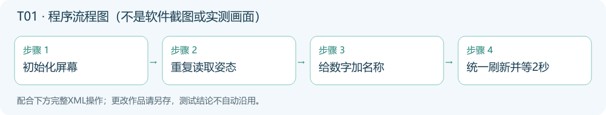

**对照积木：** 下图由测试加载本课XML后截取真实编辑器。复杂课程缩小显示用于看整体结构；需要读参数时打开原图或XML。

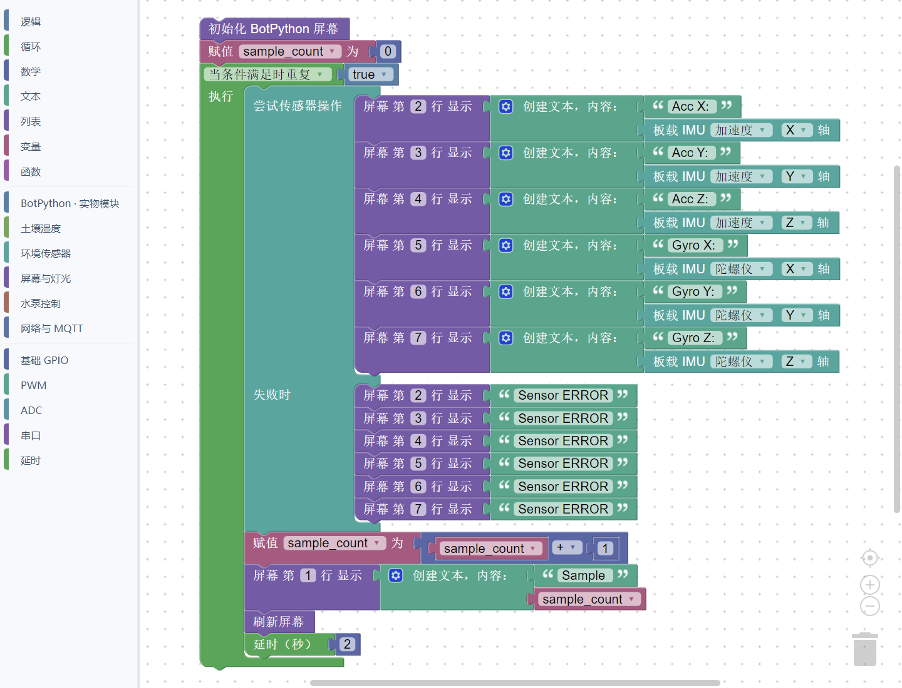

**学生动手：** 只改变板子姿态，比较同一行三次读数。

**本课达标：** 能指出姿态变化对应的数据变化，不要求解释三轴公式。

软件操作按[课堂操作图卡](课堂操作图卡.md)，接线对照[接口方向图](板卡与接线.md)。

[积木XML](examples/T01.xml) · [完整Python](examples/T01.py)

软件名称：`【BotPython】板载 IMU 与 LCD 测试`

- 目标：理解三轴加速度/角速度、采样循环和整帧刷新。只用板载IMU/LCD。
- 搭建：初始化屏幕 → sample_count=0 → 永远循环 → 读取加速度XYZ、陀螺仪XYZ → 写2～7行 → 计数加1写1行 → 刷新 → 等2秒。第8/9行留空；数值前已有Acc/Gyro及轴名，不再显示重复行号说明。
- 观察：第1行Sample递增；第2～4行是加速度，第5～7行是角速度。轻轻改变板子姿态后比较新数据，静止时仍可能有噪声。
- 练习：只保留Z轴，给显示文字加标签；仍在轮末统一刷新，不加入循环清屏。
- 验收：至少3帧，屏幕边界内、黑底白字；停止后启动T03无事件循环重复错误。
- 故障：全行Sensor ERROR先核对BotPython固件中的IMU对象，不安装普通ESP32镜像冒充专用固件。

## T02 完整传感器屏幕测试

**建议学段：初中综合** · 课堂提问：一个传感器没接，其他读数还能显示吗？

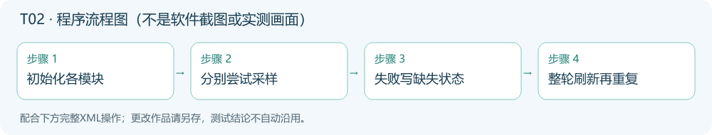

**对照积木：** 下图由测试加载本课XML后截取真实编辑器。复杂课程缩小显示用于看整体结构；需要读参数时打开原图或XML。

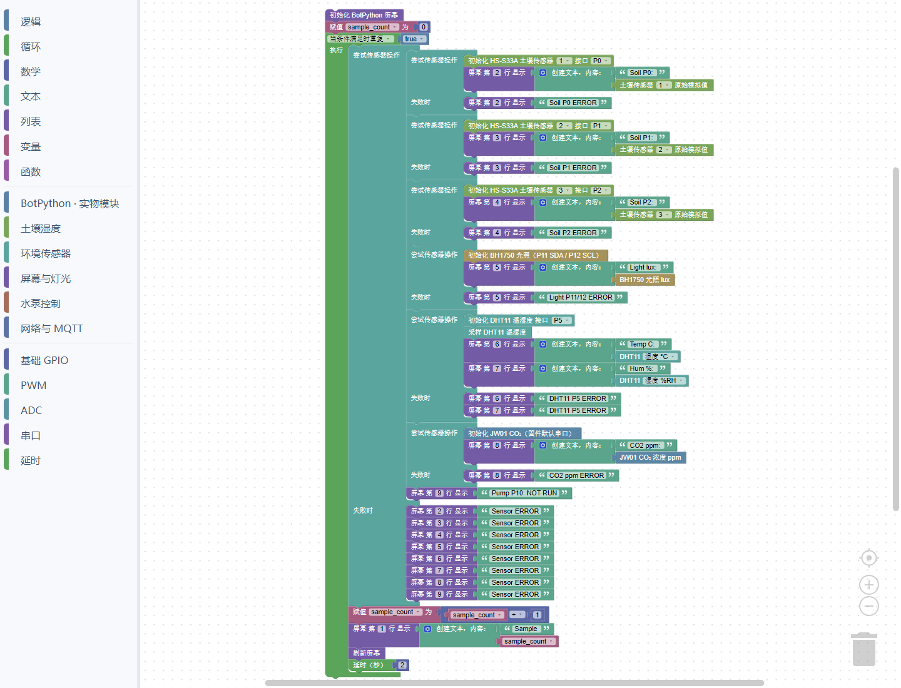

**学生动手：** 不带电拔线；由教师断电后改变接线，再运行比较。

**本课达标：** 能区分某行缺失与整个程序停止。

软件操作按[课堂操作图卡](课堂操作图卡.md)，接线对照[接口方向图](板卡与接线.md)。

[积木XML](examples/T02.xml) · [完整Python](examples/T02.py)

软件名称：`【BotPython】完整传感器屏幕测试`

- 目标：多个传感器分别失败时仍执行后续流程。
- 接线：土壤P0/P1/P2，BH1750 SDA=P11/SCL=P12，DHT11=P5，JW01按驱动串口；水泵仅显示NOT RUN，不启动。
- 搭建：每个传感器用独立“尝试传感器操作/失败时”包裹；正常读取填各行，失败填状态，最后统一刷新。
- 显示：1=Sample，2～4=三路ADC，5=光照lux，6=温度，7=湿度，8=CO₂ ppm，9=Pump P10: NOT RUN。
- 练习：保持土壤连接、数字传感器缺失，确认土壤仍更新。断电后接齐某一外设，再重新运行比较。
- 验收：至少3轮，无外设的数字输入显示NOT CONNECTED/错误状态，不阻断其他采样；三路模拟输入未接可能有浮空数值，不能当成成功识别。
- 故障：若屏幕某行报错而Sample继续，这是容错路径；若Sample停止才进一步看串口异常。

## T03 HS-S33A 土壤采样

**建议学段：小学3～6年级** · 课堂提问：不同土壤状态，数字相同吗？

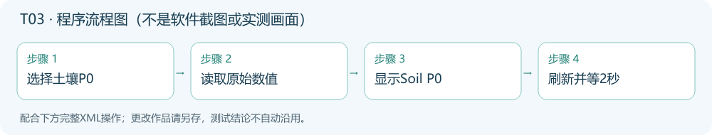

**对照积木：** 下图由测试加载本课XML后截取真实编辑器。复杂课程缩小显示用于看整体结构；需要读参数时打开原图或XML。

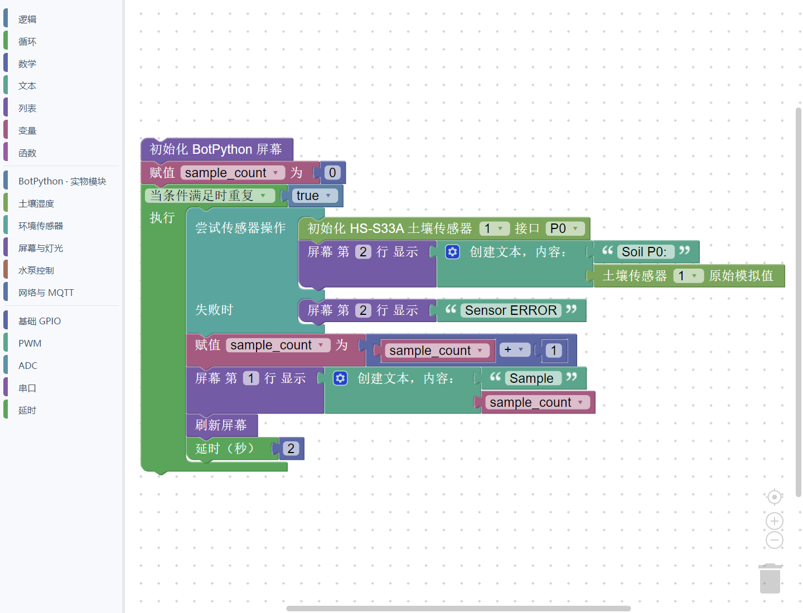

**学生动手：** 记录两种土壤条件各三次读数；板子远离水。

**本课达标：** 能说出原始数值不是湿度百分比。

软件操作按[课堂操作图卡](课堂操作图卡.md)，接线对照[接口方向图](板卡与接线.md)。

[积木XML](examples/T03.xml) · [完整Python](examples/T03.py)

软件名称：`【BotPython】HS-S33A 土壤采样`

- 目标：读取模拟电压对应的原始ADC；接HS-S33A信号到P0(GPIO1)，电源/地按模块规格共地。
- 搭建：屏幕初始化 → 循环初始化土壤通道1/P0并读ADC → 写第2行 → 第1行计数 → 刷新 → 等2秒。
- 观察：第2行是原始值，不是百分比。改变土壤接触条件，比较多次采样；不得由单次原始值推断精确湿度。
- 练习：记录干、湿两种参考值，再使用“土壤百分比”积木填入实测校准端点；端点不能相等。原始课程仍保留ADC用于核对。
- 验收：至少3次读取且计数递增，输入变化时读数随之变化；稳定环境允许数值相近。模拟输入无法可靠自动判断传感器是否插上。
- 故障：一直0/满量程先查供电、共地、接线和量程，别通过伪造随机值解决。

## T04 已接入三传感器测试

**建议学段：小学5～6年级／初中** · 课堂提问：缺少温湿度模块，会影响土壤和光照吗？

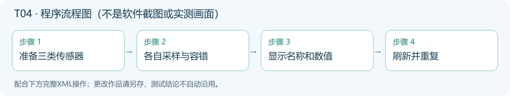

**对照积木：** 下图由测试加载本课XML后截取真实编辑器。复杂课程缩小显示用于看整体结构；需要读参数时打开原图或XML。

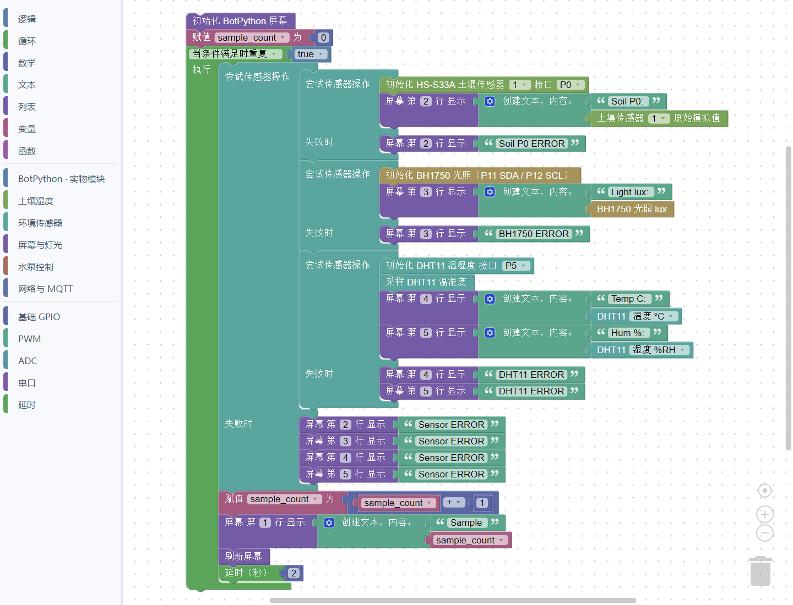

**学生动手：** 先确认实际接入哪些模块，再预测哪些行会显示缺失。

**本课达标：** 能把NOT CONNECTED解释为未接入或读取失败。

软件操作按[课堂操作图卡](课堂操作图卡.md)，接线对照[接口方向图](板卡与接线.md)。

[积木XML](examples/T04.xml) · [完整Python](examples/T04.py)

软件名称：`【BotPython】已接入三传感器测试`

- 目标：把土壤、光照、温湿度集中到一个屏幕。“已接入”是历史名称，不证明当前三种都已插上。
- 接线：HS-S33A=P0；BH1750 SDA=P11、SCL=P12；DHT11=P5。
- 搭建：土壤setup/read → 光照setup/read → DHTsetup/measure/temperature/humidity，各自容错 → Sample → 一次刷新 → 等2秒。
- 显示：第2行ADC、第3行lux、第4行摄氏温度、第5行相对湿度。第1行计数。初始化只创建读取对象，不是用缓存替代measure。
- 练习：遮挡BH1750，再观察光照；保持土壤可读而DHT缺失时，确认后续循环继续。
- 验收：模拟正常/缺失两路径均连续更新；实物光照/温湿度必须接齐后才能验收测量正确。

## T05 DHT11 温湿度

**建议学段：小学5～6年级** · 课堂提问：温度和湿度是同一个量吗？

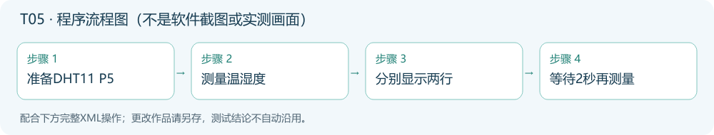

**对照积木：** 下图由测试加载本课XML后截取真实编辑器。复杂课程缩小显示用于看整体结构；需要读参数时打开原图或XML。

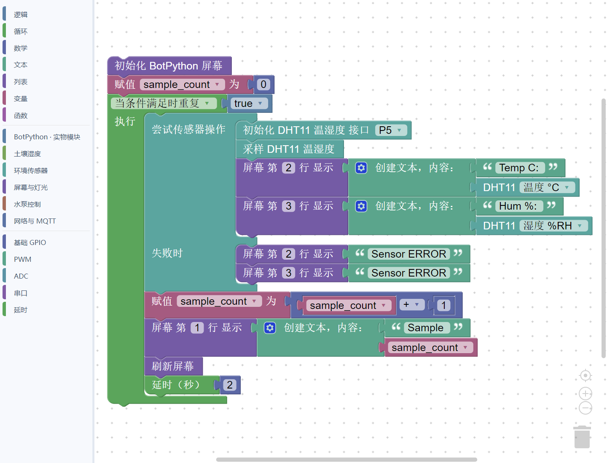

**学生动手：** 未接DHT11时只学习缺失提示，不编造温湿度。

**本课达标：** 能分清Temp C与Hum %。

软件操作按[课堂操作图卡](课堂操作图卡.md)，接线对照[接口方向图](板卡与接线.md)。

[积木XML](examples/T05.xml) · [完整Python](examples/T05.py)

软件名称：`【BotPython】DHT11 温湿度`

- 接线：DHT11数据到P5(GPIO21)。目标是理解一次measure后读取同次温度和湿度。
- 搭建：DHT初始化 → 循环measure → 读取temperature写2行、humidity写3行 → Sample写1行 → 刷新 → 等2秒。
- 观察：2行温度、3行湿度；未接时两行NOT CONNECTED，计数继续。
- 练习：修改显示为带单位文字，同时保留每轮measure和不小于2秒的等待。
- 验收：正常输入两值均变化；缺失后不保留旧值冒充新值；恢复接线后重运行检查。实际变化速度取决于传感器，不能要求每轮必变。
- 故障：只调用temperature/humidity而漏measure会用旧采样；采样过快可能失败。

## T06 BH1750 光照

**建议学段：小学3～6年级** · 课堂提问：挡住光，读数如何变化？

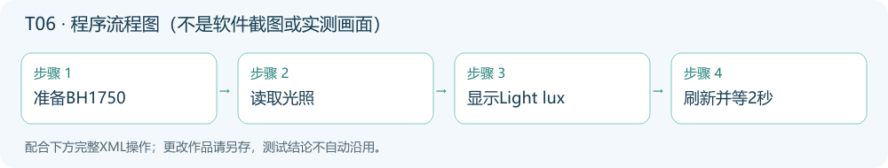

**对照积木：** 下图由测试加载本课XML后截取真实编辑器。复杂课程缩小显示用于看整体结构；需要读参数时打开原图或XML。

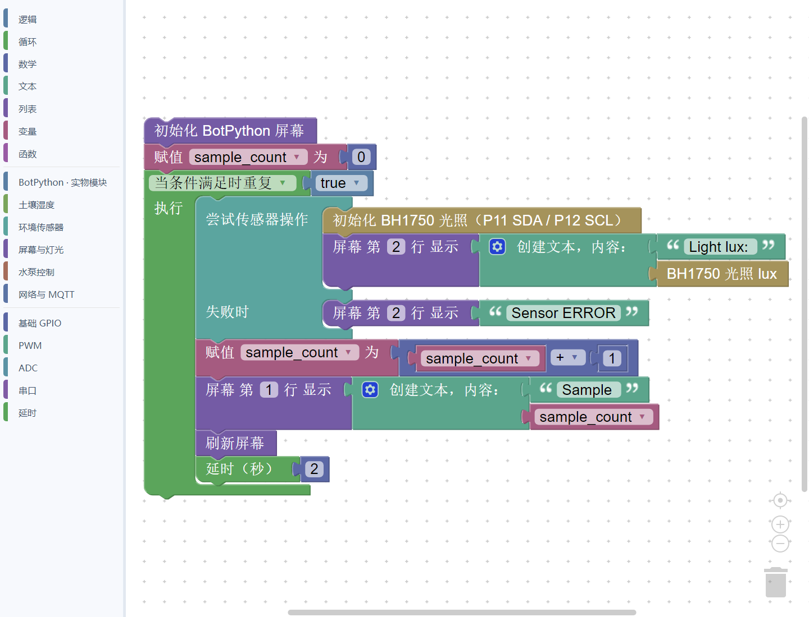

**学生动手：** 用手遮挡后移开，不改变接线，记录两组读数。

**本课达标：** 能用数据说明明暗变化。

软件操作按[课堂操作图卡](课堂操作图卡.md)，接线对照[接口方向图](板卡与接线.md)。

[积木XML](examples/T06.xml) · [完整Python](examples/T06.py)

软件名称：`【BotPython】BH1750 光照`

- 接线：音拓BH1750，SDA=P11(GPIO41)、SCL=P12(GPIO2)。目标使用固件 `bh1750.BH1750().read()`，不把P12当ADC。
- 搭建：光照初始化 → 循环read → 第2行lux → Sample → 刷新 → 等2秒。生成器的安全适配器缓存驱动对象并处理读取失败。
- 练习：用遮挡/环境光改变输入，不改I²C引脚；记录至少3轮。
- 验收：有模块时输出合理非负读数，缺模块时NOT CONNECTED且继续；数值精度需要参考仪器，当前测试不宣称计量校准通过。
- 故障：没有数据先查SDA/SCL是否反接及固件驱动；不要用GPIO2闪灯例同时占用SCL。

## T07 JW01 CO₂

**建议学段：小学5～6年级／初中** · 课堂提问：如何记录空气中CO₂的变化？

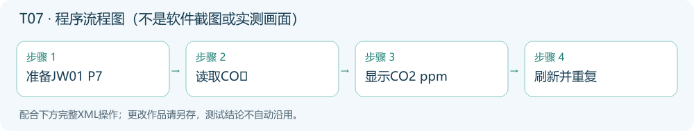

**对照积木：** 下图由测试加载本课XML后截取真实编辑器。复杂课程缩小显示用于看整体结构；需要读参数时打开原图或XML。

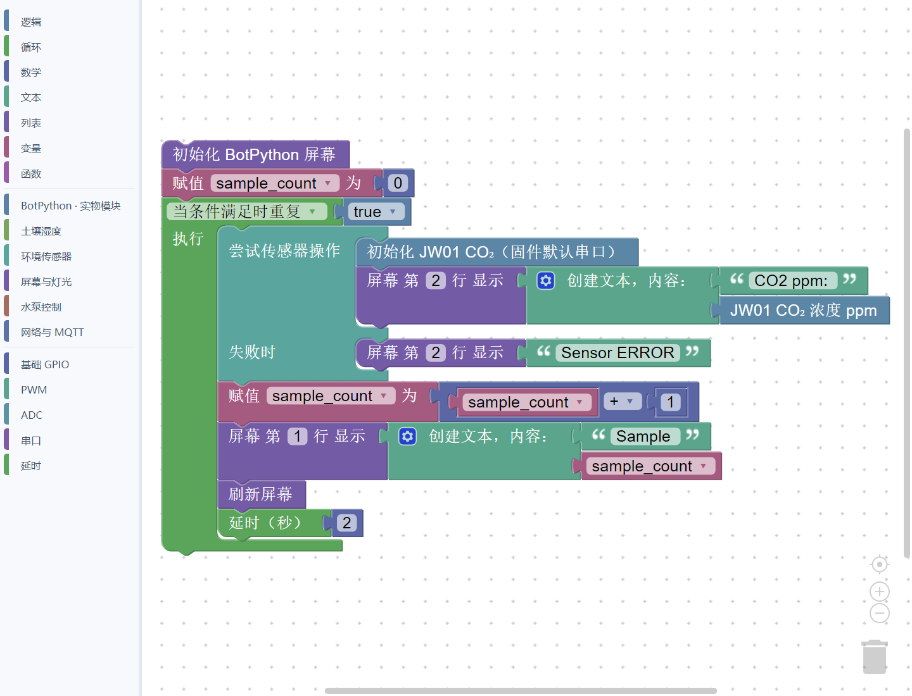

**学生动手：** 正常通风环境记录三次读数；不把结果作为健康判断。

**本课达标：** 能说明ppm是浓度单位，稳定读数不等于卡住。

软件操作按[课堂操作图卡](课堂操作图卡.md)，接线对照[接口方向图](板卡与接线.md)。

[积木XML](examples/T07.xml) · [完整Python](examples/T07.py)

软件名称：`【BotPython】JW01 CO₂`

- 目标：通过固件 `co2_sensors_jw01.CO2SensorJW01` 的 `read_co2_ppm()` 采样。
- 前置：CO₂接P7(GPIO42)。当前驱动默认UART1、RX42、TX38、9600；模块发送线接板端RX，并按模块规格核对供电、共地和预热。其他固件仍需核对默认配置。
- 搭建：CO₂初始化/读取 → 第2行ppm → Sample → 刷新 → 等2秒；模块未接或没有新数据时显示状态。
- 练习：在正常通风环境观察多轮；用测试模拟验证断流与恢复，不用虚构0ppm表示成功。
- 验收：缺模块继续；有模块需校验新鲜数据和参考测量，不能由驱动实例创建成功推出传感器存在。
- 故障：长期NOT CONNECTED检查串口接线、预热和驱动；已读到CO₂值，但没有标准仪器做浓度校准，也没有物理拔插验证。

## T08 温湿度显示屏

**建议学段：小学5～6年级** · 课堂提问：怎样让别人一眼看懂温湿度？

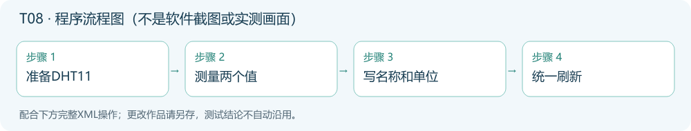

**对照积木：** 下图由测试加载本课XML后截取真实编辑器。复杂课程缩小显示用于看整体结构；需要读参数时打开原图或XML。

**学生动手：** 比较只有数字与带名称的显示，不删除完整支持代码。

**本课达标：** 温度和湿度同时保留，不相互覆盖。

软件操作按[课堂操作图卡](课堂操作图卡.md)，接线对照[接口方向图](板卡与接线.md)。

[积木XML](examples/T08.xml) · [完整Python](examples/T08.py)

软件名称：`【BotPython】温湿度显示屏`

- 目标：学习固定行LCD排版，接DHT11到P5。
- 搭建：与T05相同采样流程，将温度放第2行、湿度第3行，第1行留给Sample；写完后统一刷新。
- 观察：240×240屏最多9行；长文本省略，不换行挤出屏幕；不循环fill。
- 练习：添加第4行“DHT11 P5”，只在内容变化时更新；确保温度不被计数覆盖。
- 验收：正常模拟第一帧同时有 `Temp C: 20`、`Hum %: 40`；缺失时两行带名称提示；停止后切换T01无需重新创建LVGL事件循环。
- 已修正原例温度写第1行而被Sample覆盖的问题。旧EXE/旧XML仍可能保留旧布局，请使用本目录文件。

## T09 水泵关闭

**建议学段：初中／教师演示** · 课堂提问：为什么“关闭”也要先核对接线？

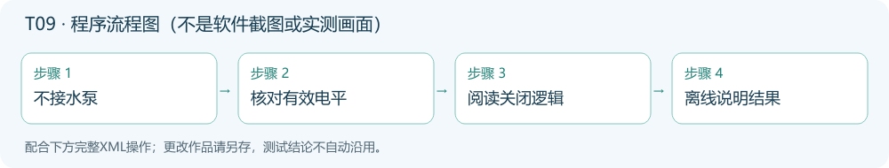

**对照积木：** 下图由测试加载本课XML后截取真实编辑器。复杂课程缩小显示用于看整体结构；需要读参数时打开原图或XML。

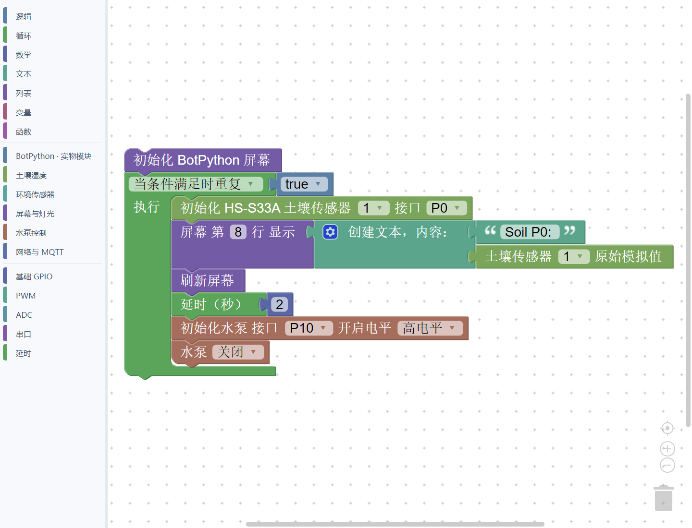

**学生动手：** 仅读图和代码；引脚资料冲突未解决前不接泵运行。

**本课达标：** 能解释高有效与低有效会使动作相反。

软件操作按[课堂操作图卡](课堂操作图卡.md)，接线对照[接口方向图](板卡与接线.md)。

[积木XML](examples/T09.xml) · [完整Python](examples/T09.py)

软件名称：`【BotPython】水泵关闭`

- 目标：认识有效电平与关闭状态；当前例P10、ACTIVE=1，即高有效、关闭写0。
- 前置：由教师核对驱动有效电平；低有效驱动若直接运行本例会得到相反动作。不能把“关闭”名称当电气保证。
- 程序顺序：第8行显示P0土壤并刷新 → 等2秒 → 初始化P10并写关闭；循环重复。当前不是即时急停程序。
- 练习：先在离线测试模拟确认只写关闭电平；不要接泵做首次实验。需要限时动作另设明确授权与测试，不包含在本例中。
- 验收：模拟记录所有P10写入均为0；真实驱动动作待核对接线/有效电平后验收。不驱动任何水泵。

## T10 MQTT 发布模板

**建议学段：初中拓展** · 课堂提问：本地显示与网络发布有什么不同？

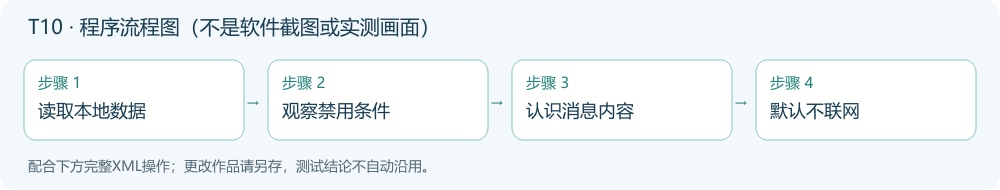

**对照积木：** 下图由测试加载本课XML后截取真实编辑器。复杂课程缩小显示用于看整体结构；需要读参数时打开原图或XML。

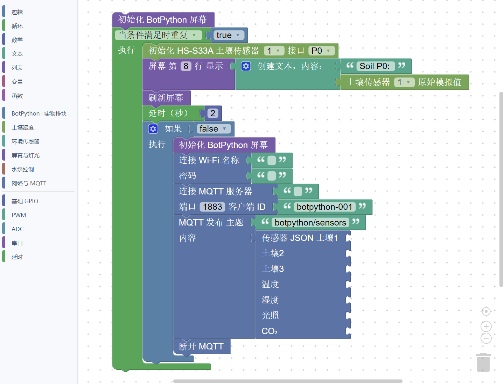

**学生动手：** 用纸卡写一个主题和数据消息，不填写真实密码。

**本课达标：** 能说明默认收不到消息是预期行为。

软件操作按[课堂操作图卡](课堂操作图卡.md)，接线对照[接口方向图](板卡与接线.md)。

[积木XML](examples/T10.xml) · [完整Python](examples/T10.py)

软件名称：`【BotPython】MQTT 发布模板`

- 目标：理解采样值→JSON→主题发布。默认联网分支是 `if False`，因此直接运行只在第8行显示P0，不连接Wi-Fi、不发布。
- 搭建：观察禁用条件内Wi-Fi连接、MQTT客户端、publish、disconnect；JSON空字段是null，主题和客户端ID是不同参数。
- 配置练习：在自己的副本填写允许使用的网络、服务地址、唯一客户端ID和主题，把实际已采样变量接入JSON；教师明确启用后才改条件。默认端口1883/匿名模板没有TLS配置，文件中填写的密码会随项目保存。
- 验收：默认模板零网络调用、LCD继续；启用联网版另需订阅端核对每条payload、断网/重连和断开资源，不属于默认模板通过范围。
- 故障：默认不收到消息是正确行为，不是偷偷自动联网；不要把含密码的PY/XML发到公共仓库。

## T11 闪烁LED

**建议学段：小学1～6年级** · 课堂提问：怎样让灯慢一点闪？

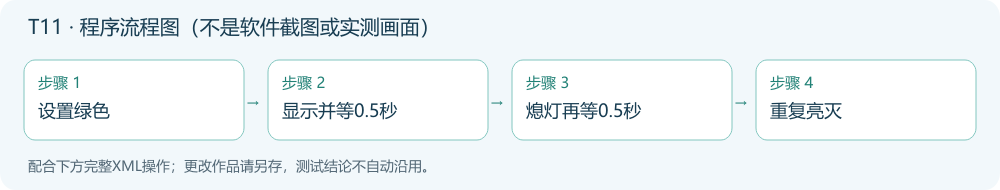

**对照积木：** 下图由测试加载本课XML后截取真实编辑器。复杂课程缩小显示用于看整体结构；需要读参数时打开原图或XML。

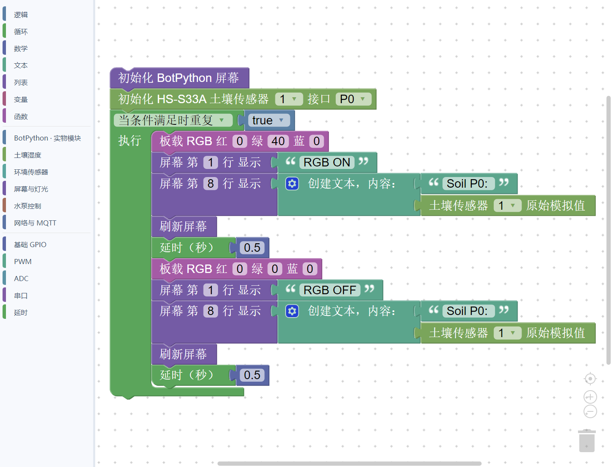

**学生动手：** 低年级教师操作；高年级只改一个等待时间。

**本课达标：** 能预测等待变长后闪烁变慢。

软件操作按[课堂操作图卡](课堂操作图卡.md)，接线对照[接口方向图](板卡与接线.md)。

[积木XML](examples/T11.xml) · [完整Python](examples/T11.py)

软件名称：`【入门】闪烁LED`

- 接线与原理：板载IO48 WS2812，rgb.fill后write，整组亮灭，无需外接LED。
- 显示：黑底白字，第一行状态，第8行重新采样的Soil P0；每步写完统一刷新，无循环清屏。
- 操作：打开XML → 查看积木与Python → 连接BotPython → 运行 → 观察至少三轮 → 停止。
- 练习与实物验收：修改亮灭间隔，观察每轮LCD状态与RGB同步。
- 边界：自动化及RAM运行不能替代人眼观察、按键操作或串口对端测试；水泵与联网不参与本课。

## T12 按钮控制LED

**建议学段：小学3～6年级** · 课堂提问：按下和松开，灯应该怎样变化？

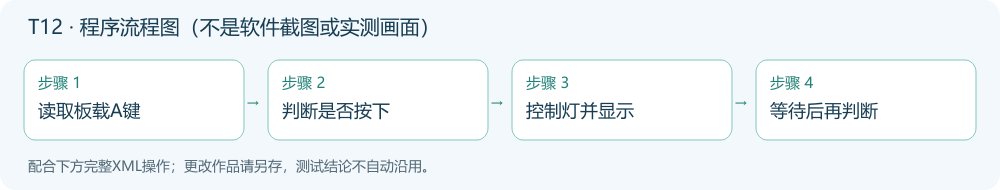

**对照积木：** 下图由测试加载本课XML后截取真实编辑器。复杂课程缩小显示用于看整体结构；需要读参数时打开原图或XML。

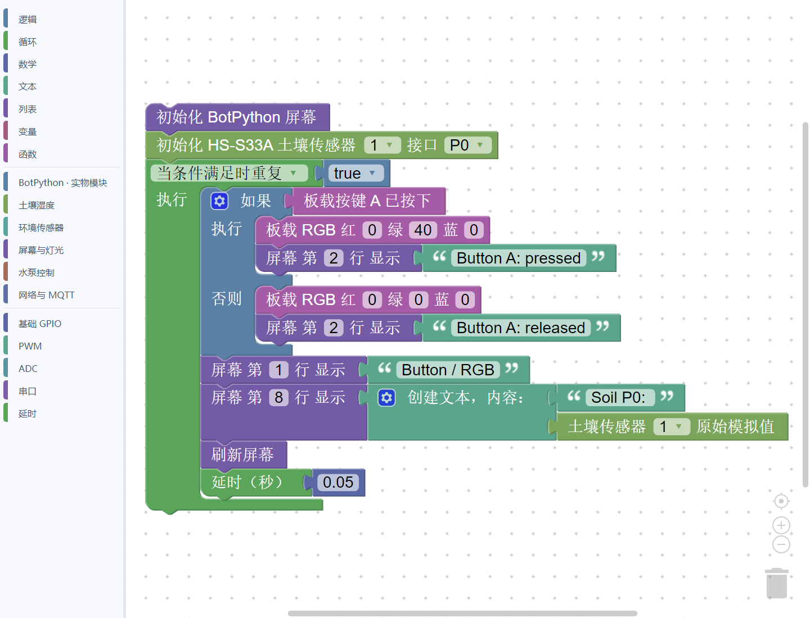

**学生动手：** 按下、松开各三次，不按BOOT代替A键。

**本课达标：** 能说出条件成立和不成立各执行什么。

软件操作按[课堂操作图卡](课堂操作图卡.md)，接线对照[接口方向图](板卡与接线.md)。

[积木XML](examples/T12.xml) · [完整Python](examples/T12.py)

软件名称：`【入门】按钮控制LED`

- 接线与原理：板载A键GPIO39，低电平按下；每50ms重新读取并更新RGB/LCD。
- 显示：黑底白字，第一行状态，第8行重新采样的Soil P0；每步写完统一刷新，无循环清屏。
- 操作：打开XML → 查看积木与Python → 连接BotPython → 运行 → 观察至少三轮 → 停止。
- 练习与实物验收：按下/松开A键，核对低电平为按下；测试中未代替人工按键验收。
- 边界：自动化及RAM运行不能替代人眼观察、按键操作或串口对端测试；水泵与联网不参与本课。

## T13 串口打招呼

**建议学段：小学3～6年级** · 课堂提问：怎样让板子向电脑打招呼？

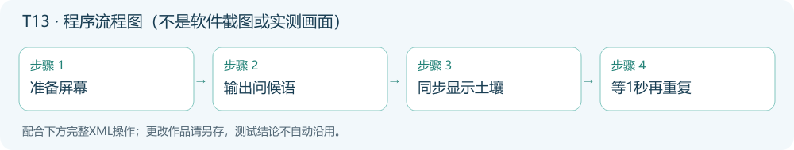

**对照积木：** 下图由测试加载本课XML后截取真实编辑器。复杂课程缩小显示用于看整体结构；需要读参数时打开原图或XML。

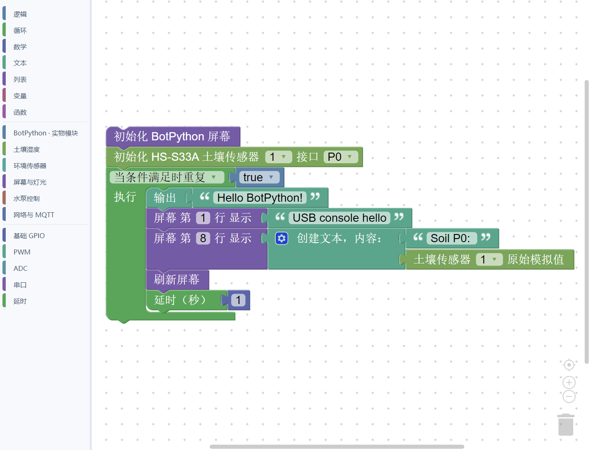

**学生动手：** 修改一句问候语，在软件输出区寻找它。

**本课达标：** 知道电脑输出区与板子LCD是两个位置。

软件操作按[课堂操作图卡](课堂操作图卡.md)，接线对照[接口方向图](板卡与接线.md)。

[积木XML](examples/T13.xml) · [完整Python](examples/T13.py)

软件名称：`【入门】串口打招呼`

- 接线与原理：通过当前USB REPL输出问候，不占用CO₂的UART1；LCD同步显示土壤数据。
- 显示：黑底白字，第一行状态，第8行重新采样的Soil P0；每步写完统一刷新，无循环清屏。
- 操作：打开XML → 查看积木与Python → 连接BotPython → 运行 → 观察至少三轮 → 停止。
- 练习与实物验收：修改问候语，在IDE控制台观察，而不是接UART1。
- 边界：自动化及RAM运行不能替代人眼观察、按键操作或串口对端测试；水泵与联网不参与本课。

## T14 呼吸灯

**建议学段：小学5～6年级** · 课堂提问：怎样让灯慢慢变亮？

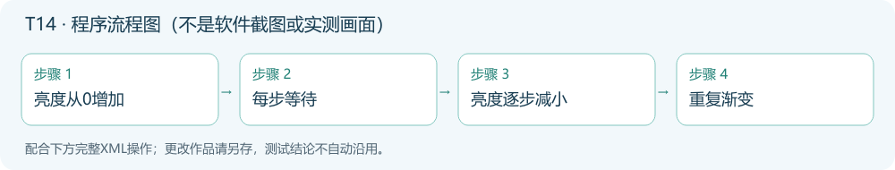

**对照积木：** 下图由测试加载本课XML后截取真实编辑器。复杂课程缩小显示用于看整体结构；需要读参数时打开原图或XML。

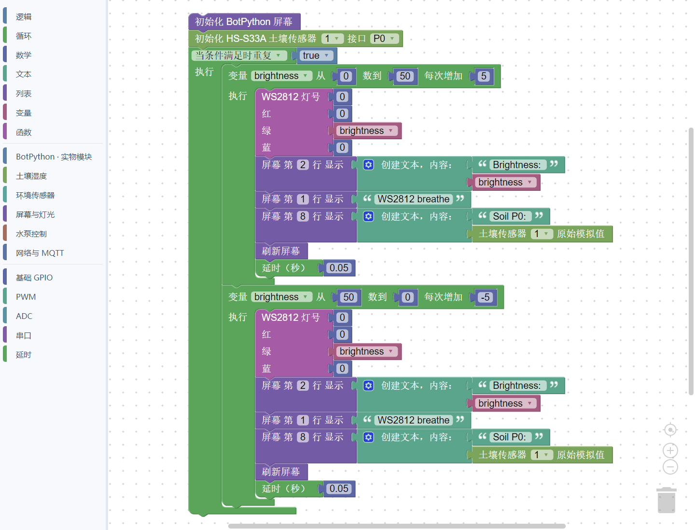

**学生动手：** 保持最大亮度50，只改变等待时间比较效果。

**本课达标：** 能区分渐变与直接开关。

软件操作按[课堂操作图卡](课堂操作图卡.md)，接线对照[接口方向图](板卡与接线.md)。

[积木XML](examples/T14.xml) · [完整Python](examples/T14.py)

软件名称：`【进阶】呼吸灯`

- 接线与原理：WS2812第0灯渐亮渐暗，亮度0～50，每步50ms；不是普通PWM。
- 显示：黑底白字，第一行状态，第8行重新采样的Soil P0；每步写完统一刷新，无循环清屏。
- 操作：打开XML → 查看积木与Python → 连接BotPython → 运行 → 观察至少三轮 → 停止。
- 练习与实物验收：修改最大亮度与50ms步进延时，避免删除延时导致闪变。
- 边界：自动化及RAM运行不能替代人眼观察、按键操作或串口对端测试；水泵与联网不参与本课。

## T15 温度监测

**建议学段：小学5～6年级** · 课堂提问：为什么每次测量都要等待？

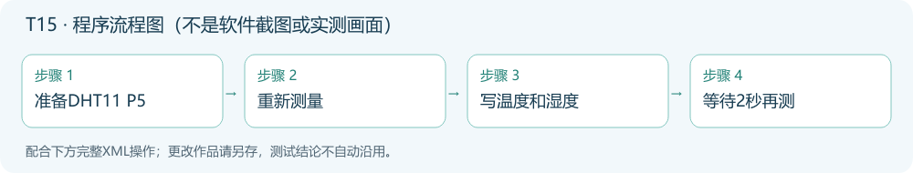

**对照积木：** 下图由测试加载本课XML后截取真实编辑器。复杂课程缩小显示用于看整体结构；需要读参数时打开原图或XML。

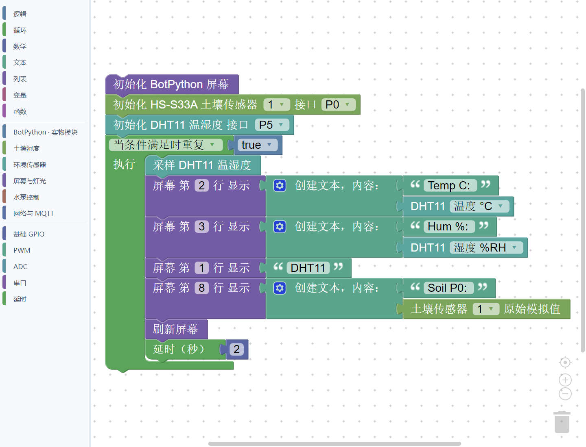

**学生动手：** 保持采样间隔，不把等待删掉；未接时观察缺失提示。

**本课达标：** 能说明循环需要重新读取数据。

软件操作按[课堂操作图卡](课堂操作图卡.md)，接线对照[接口方向图](板卡与接线.md)。

[积木XML](examples/T15.xml) · [完整Python](examples/T15.py)

软件名称：`【进阶】温度监测`

- 接线与原理：DHT11接P5，温湿度带名称显示；未接显示NOT CONNECTED，循环继续。
- 显示：黑底白字，第一行状态，第8行重新采样的Soil P0；每步写完统一刷新，无循环清屏。
- 操作：打开XML → 查看积木与Python → 连接BotPython → 运行 → 观察至少三轮 → 停止。
- 练习与实物验收：接DHT11前先断电，未接时确认两行NOT CONNECTED且土壤继续刷新。
- 边界：自动化及RAM运行不能替代人眼观察、按键操作或串口对端测试；水泵与联网不参与本课。

## T16 流水灯

**建议学段：小学3～6年级** · 课堂提问：灯号从几开始？

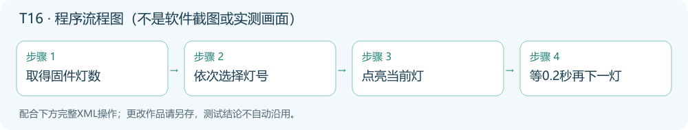

**对照积木：** 下图由测试加载本课XML后截取真实编辑器。复杂课程缩小显示用于看整体结构；需要读参数时打开原图或XML。

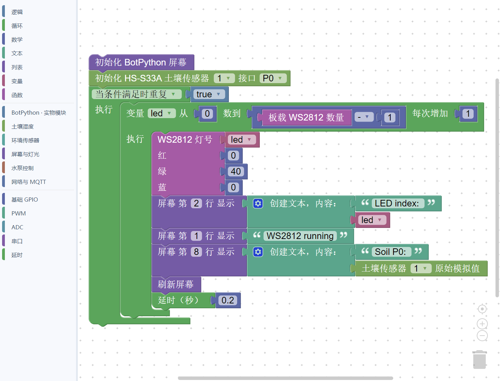

**学生动手：** 比较灯号0、1、2与实际可见灯；只有一颗时会有暗段。

**本课达标：** 能说明固件数量与实物数量可能不同。

软件操作按[课堂操作图卡](课堂操作图卡.md)，接线对照[接口方向图](板卡与接线.md)。

[积木XML](examples/T16.xml) · [完整Python](examples/T16.py)

软件名称：`【进阶】流水灯`

- 接线与原理：使用固件rgb数量逐灯点亮，每步200ms；固件配置3灯，若实物仅装1灯会有间歇。
- 显示：黑底白字，第一行状态，第8行重新采样的Soil P0；每步写完统一刷新，无循环清屏。
- 操作：打开XML → 查看积木与Python → 连接BotPython → 运行 → 观察至少三轮 → 停止。
- 练习与实物验收：调整单步延时；固件配置3灯，真实仅1灯时只能看到第0步。
- 边界：自动化及RAM运行不能替代人眼观察、按键操作或串口对端测试；水泵与联网不参与本课。

## T17 倒计时发射

**建议学段：小学3～6年级** · 课堂提问：倒计时结束之后会怎样？

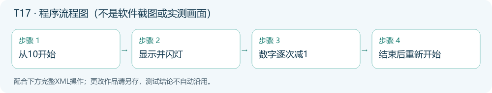

**对照积木：** 下图由测试加载本课XML后截取真实编辑器。复杂课程缩小显示用于看整体结构；需要读参数时打开原图或XML。

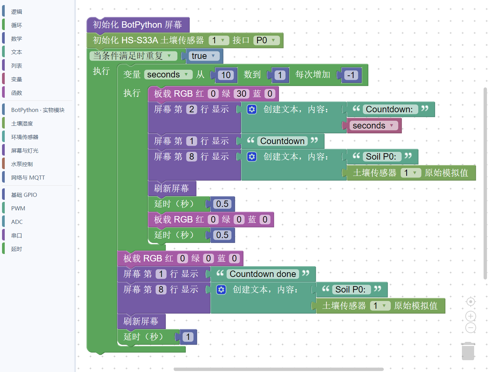

**学生动手：** 把起点改成3，观察完整一轮；本课没有发射装置。

**本课达标：** 能预测3、2、1之后重新开始。

软件操作按[课堂操作图卡](课堂操作图卡.md)，接线对照[接口方向图](板卡与接线.md)。

[积木XML](examples/T17.xml) · [完整Python](examples/T17.py)

软件名称：`【进阶】倒计时发射`

- 接线与原理：10到1倒计时，以RGB闪烁提示；结束后重新开始，不控制任何发射执行器。
- 显示：黑底白字，第一行状态，第8行重新采样的Soil P0；每步写完统一刷新，无循环清屏。
- 操作：打开XML → 查看积木与Python → 连接BotPython → 运行 → 观察至少三轮 → 停止。
- 练习与实物验收：将倒计时起点改3，观察完成后重新开始。
- 边界：自动化及RAM运行不能替代人眼观察、按键操作或串口对端测试；水泵与联网不参与本课。

## T18 串口回显

**建议学段：初中拓展** · 课堂提问：发送的数据怎样原样返回？

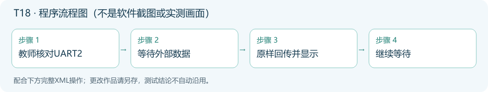

**对照积木：** 下图由测试加载本课XML后截取真实编辑器。复杂课程缩小显示用于看整体结构；需要读参数时打开原图或XML。

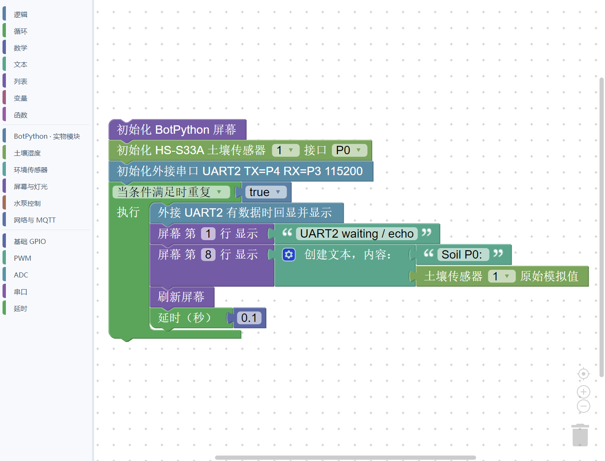

**学生动手：** 没有对端时只看等待；外接设备须教师确认电平及交叉接线。

**本课达标：** 能区分TX发送、RX接收与USB控制台。

软件操作按[课堂操作图卡](课堂操作图卡.md)，接线对照[接口方向图](板卡与接线.md)。

[积木XML](examples/T18.xml) · [完整Python](examples/T18.py)

软件名称：`【进阶】串口回显`

- 接线与原理：外接UART2 TX=P4(GPIO14)、RX=P3(GPIO13)，115200；需另一串口设备交叉接线共地，不占用CO₂ UART1。未接时循环显示等待。
- 显示：黑底白字，第一行状态，第8行重新采样的Soil P0；每步写完统一刷新，无循环清屏。
- 操作：打开XML → 查看积木与Python → 连接BotPython → 运行 → 观察至少三轮 → 停止。
- 练习与实物验收：外接串口端发送hello和任意字节，核对原字节回显；无接收端仅验证等待循环。
- 边界：自动化及RAM运行不能替代人眼观察、按键操作或串口对端测试；水泵与联网不参与本课。

## T19 自定义函数 · 流水灯

**建议学段：小学5～6年级／初中** · 课堂提问：能给一组积木起名字吗？

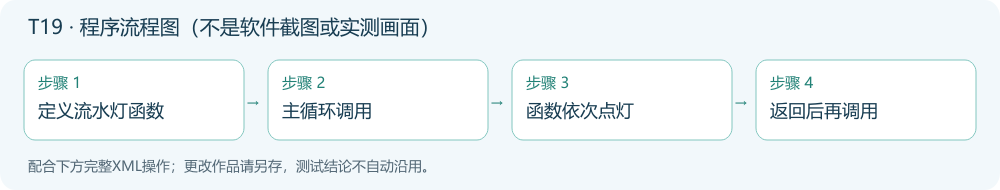

**对照积木：** 下图由测试加载本课XML后截取真实编辑器。复杂课程缩小显示用于看整体结构；需要读参数时打开原图或XML。

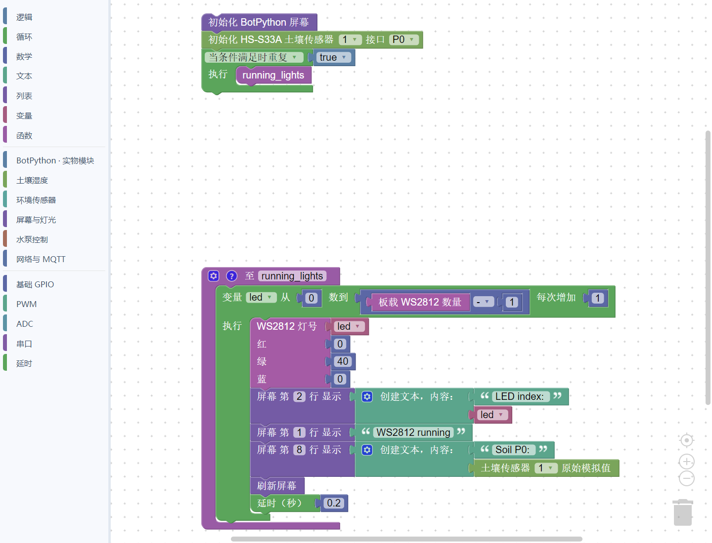

**学生动手：** 先学T16，再找函数定义和调用两个位置。

**本课达标：** 只改函数内延时，能说明调用处为何无需修改。

软件操作按[课堂操作图卡](课堂操作图卡.md)，接线对照[接口方向图](板卡与接线.md)。

[积木XML](examples/T19.xml) · [完整Python](examples/T19.py)

软件名称：`【综合】自定义函数 · 流水灯`

- 接线与原理：把WS2812逐灯点亮封装为函数；与普通流水灯使用同一驱动。
- 显示：黑底白字，第一行状态，第8行重新采样的Soil P0；每步写完统一刷新，无循环清屏。
- 操作：打开XML → 查看积木与Python → 连接BotPython → 运行 → 观察至少三轮 → 停止。
- 练习与实物验收：修改函数内单步延时，主循环只调用函数。
- 边界：自动化及RAM运行不能替代人眼观察、按键操作或串口对端测试；水泵与联网不参与本课。

## T20 自定义函数 · 呼吸灯

**建议学段：小学5～6年级／初中** · 课堂提问：同一组渐变怎样重复使用？

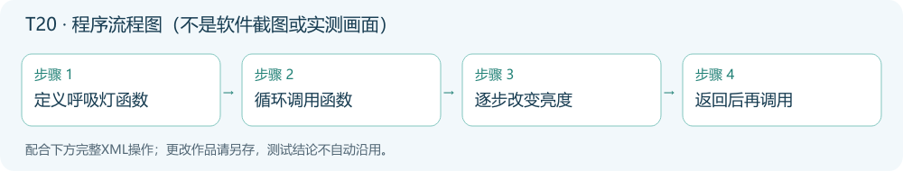

**对照积木：** 下图由测试加载本课XML后截取真实编辑器。复杂课程缩小显示用于看整体结构；需要读参数时打开原图或XML。

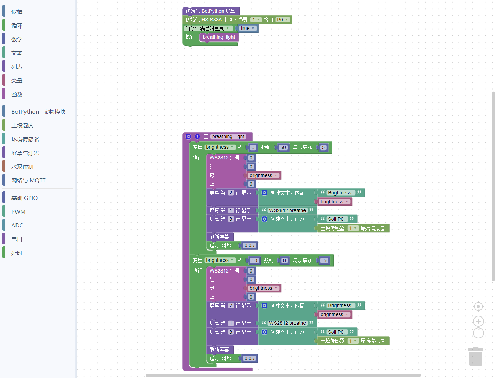

**学生动手：** 先学T14，再比较函数版与原版的相同效果。

**本课达标：** 能解释函数用于组织重复步骤。

软件操作按[课堂操作图卡](课堂操作图卡.md)，接线对照[接口方向图](板卡与接线.md)。

[积木XML](examples/T20.xml) · [完整Python](examples/T20.py)

软件名称：`【综合】自定义函数 · 呼吸灯`

- 接线与原理：把WS2812渐变封装为函数；每步延时并刷新LCD。
- 显示：黑底白字，第一行状态，第8行重新采样的Soil P0；每步写完统一刷新，无循环清屏。
- 操作：打开XML → 查看积木与Python → 连接BotPython → 运行 → 观察至少三轮 → 停止。
- 练习与实物验收：修改函数内亮度步长，比较渐变效果。
- 边界：自动化及RAM运行不能替代人眼观察、按键操作或串口对端测试；水泵与联网不参与本课。

## T21 智能夜灯

**建议学段：小学5～6年级／初中** · 课堂提问：什么时候应该自动开灯？

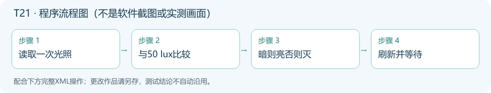

**对照积木：** 下图由测试加载本课XML后截取真实编辑器。复杂课程缩小显示用于看整体结构；需要读参数时打开原图或XML。

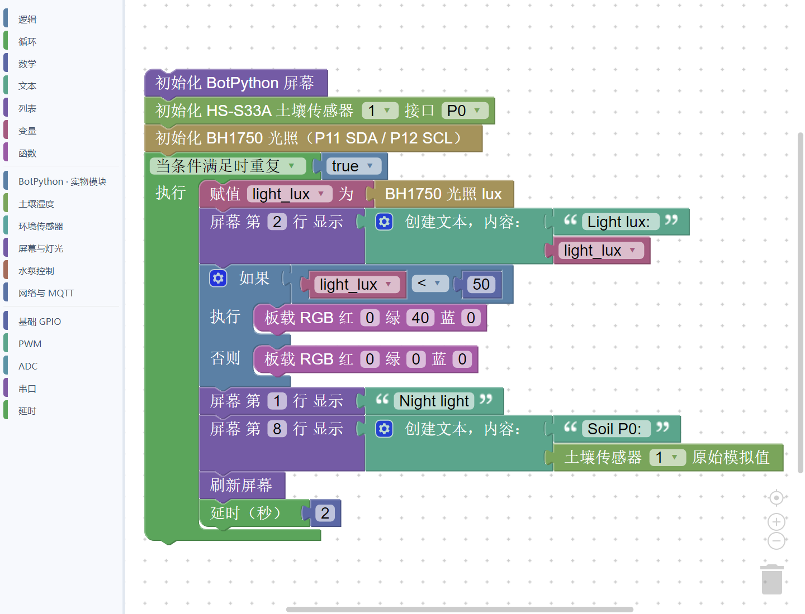

**学生动手：** 遮挡、移开各三次；不接传感器时灯应熄灭。

**本课达标：** 能用如果／否则解释夜灯决策。

软件操作按[课堂操作图卡](课堂操作图卡.md)，接线对照[接口方向图](板卡与接线.md)。

[积木XML](examples/T21.xml) · [完整Python](examples/T21.py)

软件名称：`【综合】智能夜灯`

- 接线与原理：BH1750接P11/P12，低于50lux点亮RGB；缺失时显示NOT CONNECTED且熄灯。
- 显示：黑底白字，第一行状态，第8行重新采样的Soil P0；每步写完统一刷新，无循环清屏。
- 操作：打开XML → 查看积木与Python → 连接BotPython → 运行 → 观察至少三轮 → 停止。
- 练习与实物验收：遮挡BH1750并观察50lux阈值两侧的灯效；未接数字传感器时灯保持熄灭。
- 边界：自动化及RAM运行不能替代人眼观察、按键操作或串口对端测试；水泵与联网不参与本课。

## 教师记录表

每课复制填写：编号、文件SHA256、IDE/固件版本、接线照片、输入变化、至少3轮输出、缺失/异常结果、停止后再运行、XML/PY重开、RAM/下载/断电分别结果、原程序恢复、结论与未执行原因。课程中的修改练习会改变源文件，应另存并重新验收，不沿用原例通过记录。
