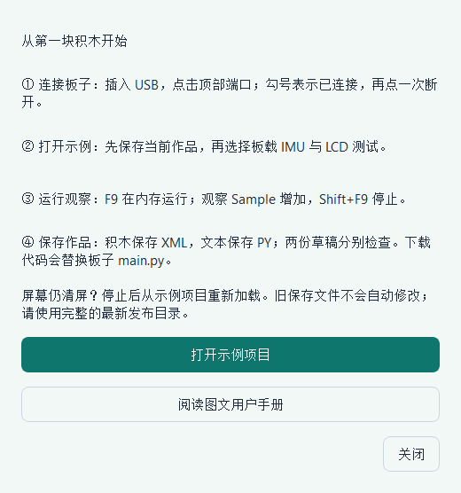
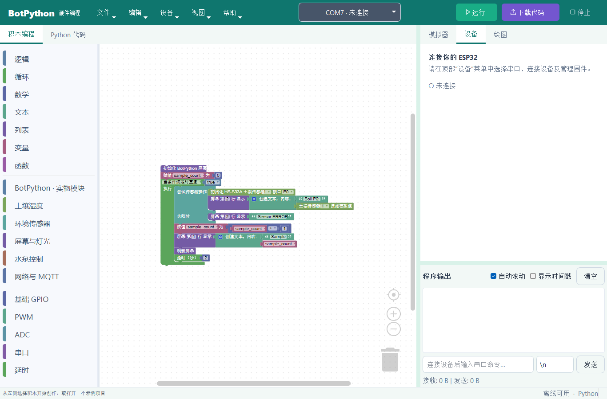
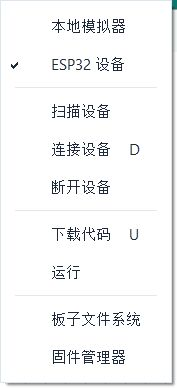
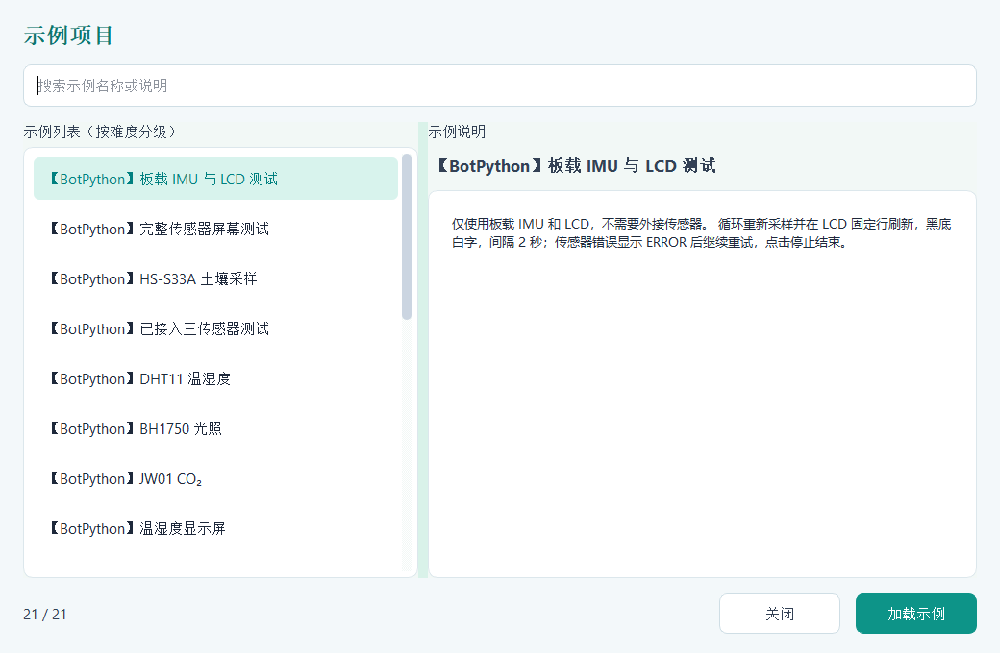
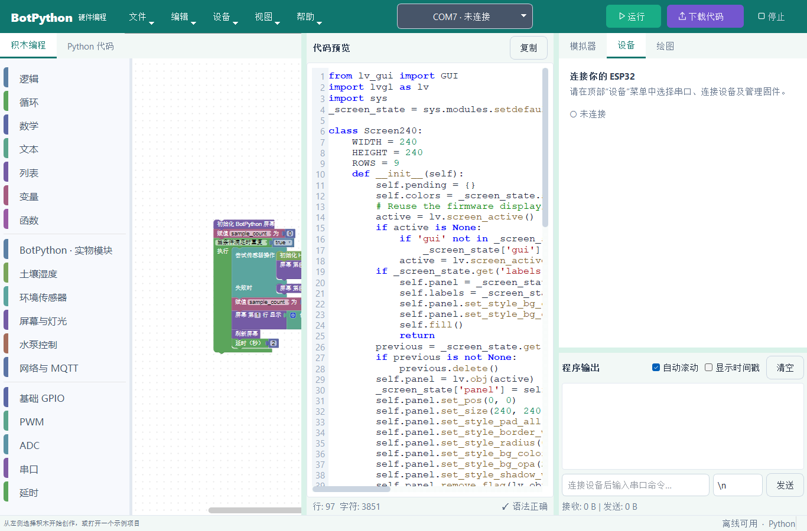
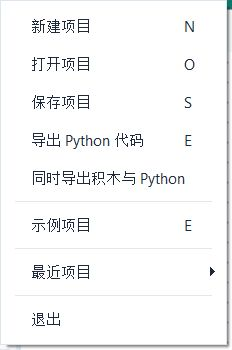
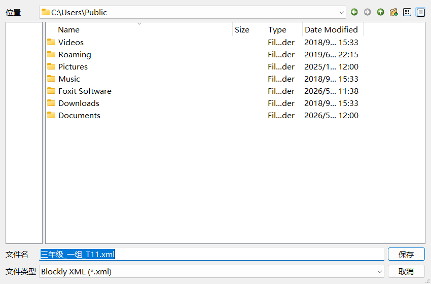
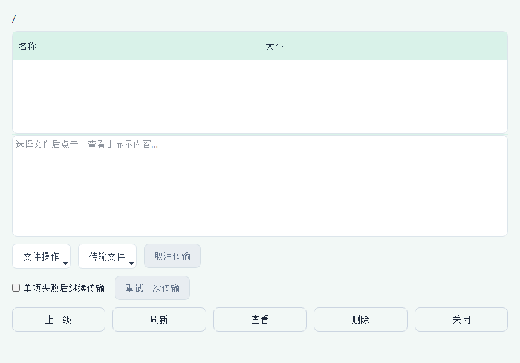
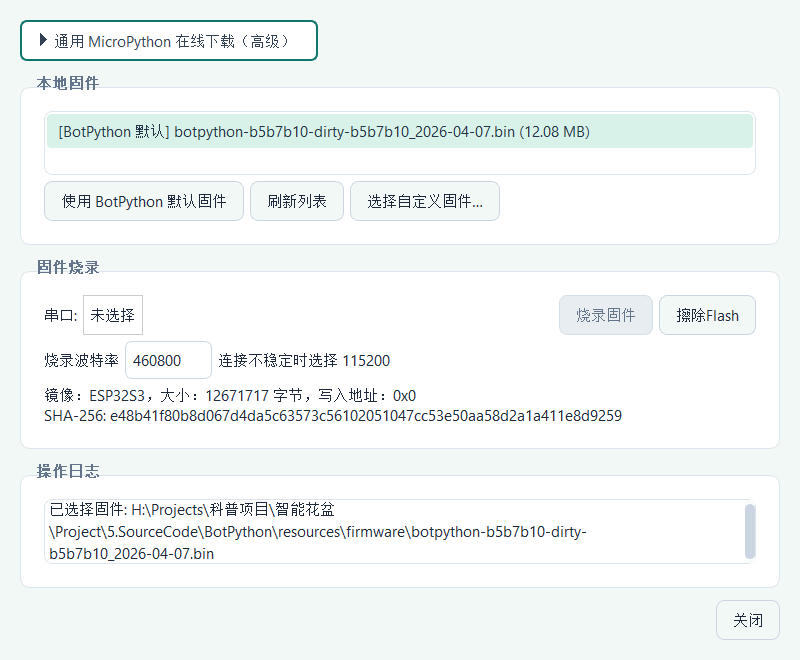
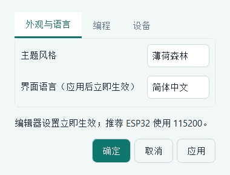

# 课堂操作图卡

21课共用这一套操作。下面是已有软件真实截图，用来认位置；未连接画面不代表设备已连接。每课中的彩色四步图是流程示意，不是软件截图，也不是实测数据。

## 1　打开软件，找到帮助

安装后打开BotPython，按F1进入向导。第一次上课选板载课程，不必先接传感器。

**检查：** 能看到“打开示例项目”入口。无法启动先查安装与完整目录，不尝试给板子刷固件。

## 2　连接板子，认清三个按钮

用USB数据线连接电脑，选择顶部端口。当前端口的勾号和状态文字表示连接；端口号不固定。

课堂首次试验点击**运行**；需要结束点击**停止**。**下载**会改写板上作品，第一课不用。

图中的勾号只表示**运行目标是ESP32**，不表示串口已经连接。还要检查顶部端口状态。不要把“本地模拟器”用于需要板载LCD的课程。

## 3　选择课程，读清需要哪些器材

文件 → 示例项目，选择本课名称，阅读说明后加载。已有作品先保存。

**检查：** 名称与教程相符；完整文件可从每课“积木XML”链接取得。缺少器材时按教师指南做替代活动。

## 4　先运行原例，再改一个地方

视图 → 教学模式，可并排看积木与生成代码。先照原例运行至少三轮，再改等待时间、文字或本课指定参数。

**检查：** 初始化在循环前，采样在循环内。每轮数据写完统一刷新；不要重复清空LCD。RGB清空颜色用于熄灯，与清屏不同。

## 5　停止、保存、检查作品

停止后用“文件 → 保存”保存XML。交作业可用“同时导出积木与Python”；手写Python草稿需要单独保存。重新打开XML，应能继续拖动积木。

1. 在“积木编程”页选择“文件 → 保存项目”。首次保存会打开“保存项目”窗口。
2. 选择本组作品文件夹，把文件名改为容易辨认的名字，例如“三年级_一组_T11.xml”。文件类型应为 **Blockly XML (*.xml)**。
3. 点击“保存”。若提示同名文件已存在，先确认是否确实要覆盖旧作品；保留对比实验时换一个名字。
4. 选择“文件 → 打开项目”，重新打开刚才的XML，确认积木仍能编辑。打开PY只能恢复文字代码，不能恢复积木布局。
5. 需要交两种格式时选择“同时导出积木与Python”，检查文件夹内有同名XML和PY。自己在Python页写的草稿另存，不把生成代码当手写草稿备份。

菜单图来自当前源码窗口实拍。以下图片由Qt测试创建同类型文件选择窗口，中文标签和公共目录用于演示；不是完整主程序的主题截图，也没有实际保存或覆盖文件。

## 6　教师备份板子文件（进阶）

设备 → 板子文件系统，先把原main.py下载到电脑，再考虑覆盖。列表截图为未连接空列表，不是板上实际文件清单。

## 7　固件由教师管理（进阶）

设备 → 固件管理器，核对板型和镜像。学生作品下载与固件烧录是两件事；保留备份，等待完整结束。

## 8　调整语言与阅读外观

编辑 → 设置，选择语言和主题后应用。变量名、学生输入的文字不会自动翻译。

硬件操作另见[接口方向图和断电接线步骤](板卡与接线.md)。原始接口图并未提供每个传感器插头的实拍线序，不凭线色猜接法。
